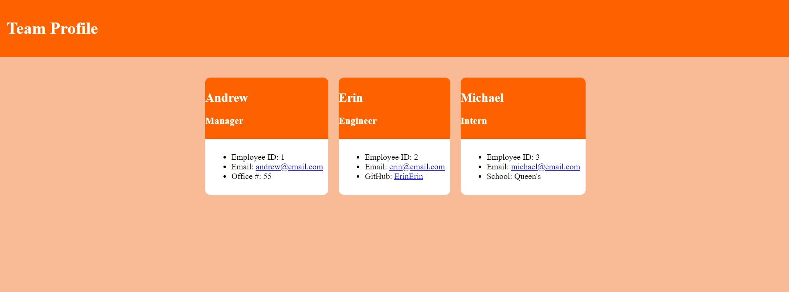

# Team-Profile-Generator

## Description
Node.js application to generate a static HTML page populated by user input to prompts.

## Table of contents
  - [Description](#description)
  - [Table of contents](#table-of-contents)
  - [Installation](#installation)
  - [Sample Output](#sample-output)
  - [Video Demo](#video-demo)
  - [Tests](#tests)
  - [Questions](#questions)

## Installation
 Both `inquirer` and `jest` node packages are required for this application. From within the terminal type `npm install` to load the dependencies, then start the program by typing `node index.js`.

## Sample Output 

[Sample of generated static HTML page](./team-profile/index.html)

## Video Demo

[Click here to view the video demo](https://drive.google.com/file/d/1ZjSRHbcAAB2qD4rreJka4ddwnzlG88oZ/view)

## Tests
 The tests were built by using class syntax and constructor functions.  

## Questions
Please direct questions to:
- E-mail: wing_andrew@hotmail.com
- Github:<https://github.com/wingeh>
